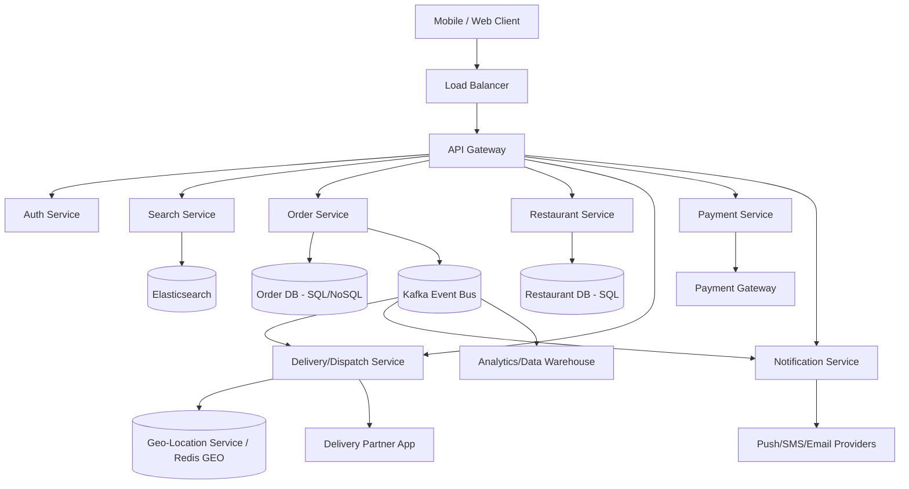
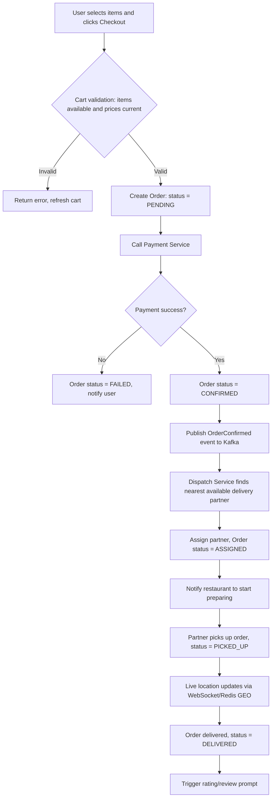
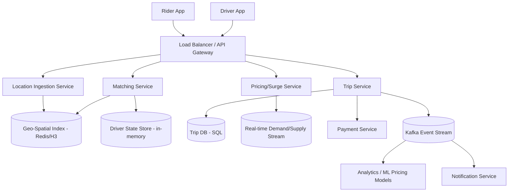
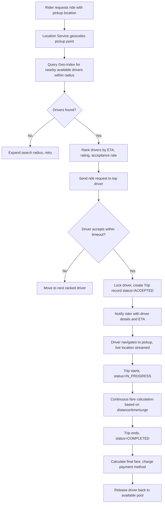
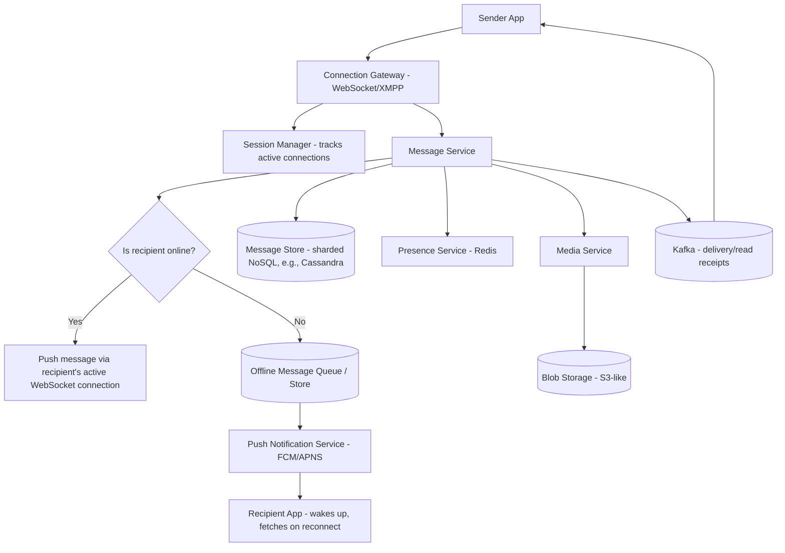
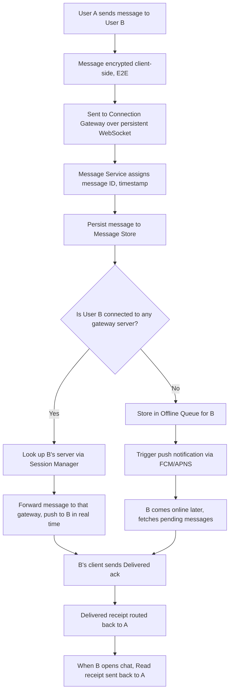
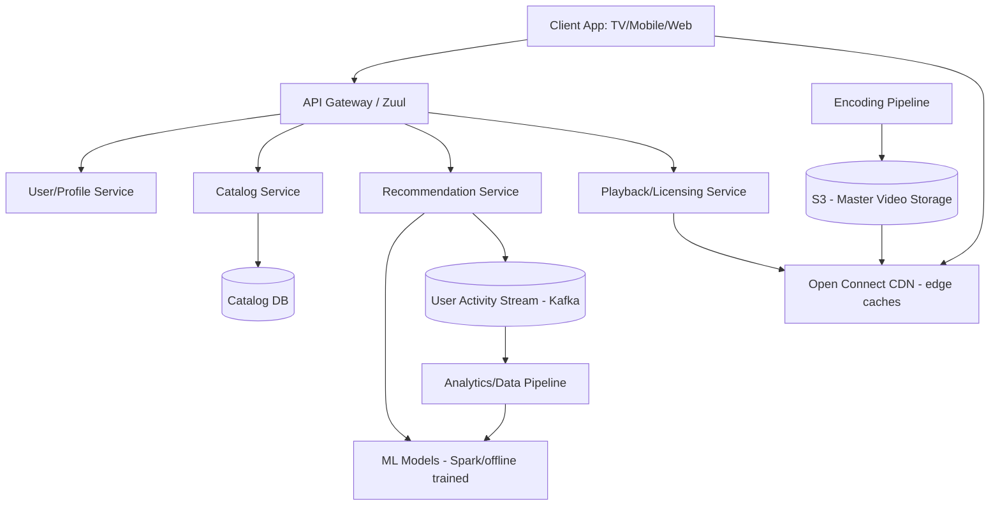
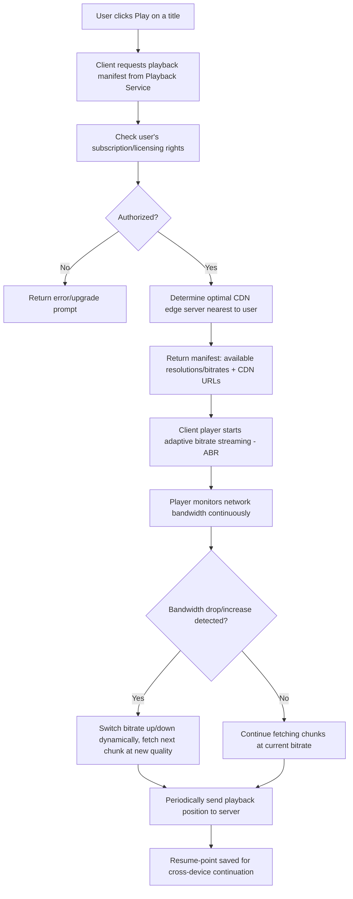

# System Design Notes
### Zomato | Uber | WhatsApp | Netflix
*(High-Level Design + Low-Level Design with Flowcharts)*

---

## 1. ZOMATO (Food Delivery Platform)

### 1.1 Requirements

**Functional**
- Search restaurants by location/cuisine
- View menu, place order, make payment
- Real-time order tracking
- Delivery partner assignment
- Ratings & reviews

**Non-Functional**
- Low latency search (< 200ms)
- High availability (99.9%)
- Consistency for payments (strong), eventual consistency for search/catalog
- Scalable to millions of concurrent users

### 1.2 High-Level Design (HLD)

### 1.3 Low-Level Design (LLD) — Order Placement Flow

### 1.4 Key Design Points
- **Database**: SQL (PostgreSQL/MySQL) for orders/payments (ACID needed); NoSQL (Cassandra) for high-write logs
- **Search**: Elasticsearch for restaurant/menu search with geo-filtering
- **Dispatch algorithm**: nearest-partner matching using geohashing (Redis GEO or Uber's H3)
- **Caching**: Redis for restaurant menus, popular searches
- **Event-driven**: Kafka decouples order → dispatch → notification → analytics

---

## 2. UBER (Ride-Hailing Platform)

### 2.1 Requirements

**Functional**
- Rider requests ride, driver accepts
- Real-time GPS tracking & ETA
- Dynamic (surge) pricing
- Trip billing & payment

**Non-Functional**
- Extremely low-latency matching (< 1s)
- High availability, partition tolerance (AP over CP for location data)
- Massive concurrent write throughput (location pings every few seconds per driver)

### 2.2 High-Level Design (HLD)

### 2.3 Low-Level Design (LLD) — Ride Matching Flow

### 2.4 Key Design Points
- **Geo-indexing**: Uber uses H3 (hexagonal hierarchical index) to bucket drivers/riders into cells for fast proximity search
- **Driver state**: Kept in-memory (Redis) for speed; periodically persisted
- **Surge pricing**: Computed per geo-cell using real-time supply/demand ratio (streaming via Kafka/Flink)
- **Consistency tradeoff**: Location data is AP (eventual consistency ok); trip/payment data is CP (strong consistency)
- **Scalability**: Location ingestion service must handle millions of GPS pings/sec — uses sharded, in-memory stores

---

## 3. WHATSAPP (Real-Time Messaging Platform)

### 3.1 Requirements

**Functional**
- 1:1 and group messaging
- Message delivery status (sent/delivered/read)
- Media sharing (images, video, docs)
- End-to-end encryption
- Online/last-seen presence

**Non-Functional**
- Extremely low latency (< 100ms for delivery)
- High availability, message durability (no message loss)
- Massive scale — billions of messages/day
- Support offline delivery (store & forward)

### 3.2 High-Level Design (HLD)

### 3.3 Low-Level Design (LLD) — Message Send Flow

### 3.4 Key Design Points
- **Connection layer**: Persistent WebSocket/XMPP connections; each user pinned to one gateway server, tracked via Session Manager (Redis)
- **Message storage**: Sharded by user ID (Cassandra-like) for horizontal scale + durability
- **Delivery guarantee**: At-least-once delivery with client-side dedup using message IDs
- **E2E Encryption**: Signal Protocol — keys never leave devices; server only relays ciphertext
- **Group messages**: Fan-out on write — server duplicates message to each group member's queue
- **Presence**: Ephemeral, stored in fast in-memory store (Redis), not durable DB

---

## 4. NETFLIX (Video Streaming Platform)

### 4.1 Requirements

**Functional**
- Browse/search catalog, personalized recommendations
- Adaptive-bitrate video streaming
- Resume playback across devices
- Multiple simultaneous streams per account

**Non-Functional**
- High availability (global, multi-region)
- Low startup latency & buffering
- Massive read-heavy scale (catalog/recommendations)
- Handle huge bandwidth via CDN

### 4.2 High-Level Design (HLD)

### 4.3 Low-Level Design (LLD) — Video Playback Flow

### 4.4 Key Design Points
- **Content delivery**: Netflix Open Connect — custom CDN with appliances placed inside ISPs for edge caching
- **Encoding**: Each video pre-encoded into multiple resolutions/bitrates (H.264/AV1) and chunked (for adaptive streaming, e.g., DASH/HLS)
- **Recommendation engine**: Offline batch ML models (collaborative filtering, deep learning) refreshed periodically; served via low-latency lookup service
- **Microservices**: Netflix pioneered this pattern — hundreds of independently deployable services behind API Gateway (Zuul)
- **Resilience**: Circuit breakers (Hystrix) to prevent cascading failures across microservices
- **Data**: Cassandra for high-write viewing history; MySQL/EVCache for catalog and metadata

---

## Quick Comparison Table

| Aspect | Zomato | Uber | WhatsApp | Netflix |
|---|---|---|---|---|
| Core challenge | Order + delivery matching | Real-time geo-matching | Real-time message delivery at scale | Content delivery at scale |
| Consistency model | Strong (payments), eventual (search) | AP (location), CP (trips/payment) | At-least-once delivery | Eventually consistent catalog |
| Key data store | SQL + Elasticsearch | Geo-index (H3) + SQL | Sharded NoSQL (Cassandra-like) | Cassandra + S3 + CDN |
| Bottleneck | Search & dispatch latency | Location ingestion throughput | Connection/session management | Bandwidth & video encoding |
| Special tech | Redis GEO | H3 hexagonal indexing | Signal Protocol (E2E) | Open Connect CDN, ABR streaming |

---

*Note: These are simplified interview-style system design overviews. Real production systems at these companies involve far more nuance (sharding strategies, consensus protocols, multi-region failover, cost optimization, etc.) beyond what's covered here.*
